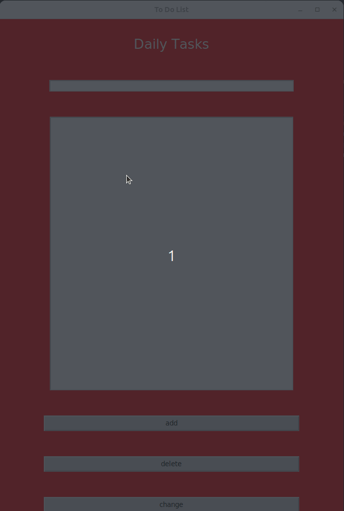

# To do list

### Description

Примечание: Раньше не работал с библиотекой “tkinter”, поэтому простите если код не соответствует “best practice”.
 

## Installation

clone rep:
```bash
git clone https://github.com/AxmetES/ToDoList.git
```

create virtual environment:
```bash
python3 -m venv venv
```

activate environment:
```bash
source venv/bin/activate
```

install requirements:
```bash
pip install -r requirements.txt
```

## Usage

```bash
python3 main.py
```

Добавления добавления записи запись вводится в верхнее поле и используется кнопка “add”. Запись сохраняется в БД MySQL.
Для удаления записи выделяется запись в поле списка задач и используется кнопка “delete”, для изменения записи, два раза кликаете по записи в списке задач, запись появится в верхнем поле текста, измените его и используете кнопку “change”.




## License

[MIT](https://choosealicense.com/licenses/mit/)